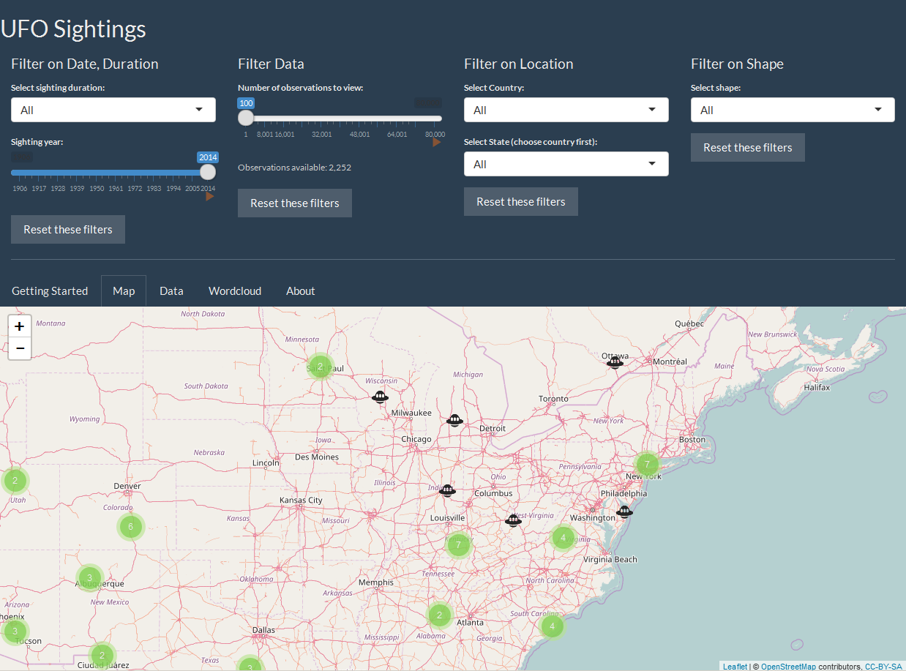

---
title       : Exploring UFO Sightings
subtitle    : For Developing Data Products, Coursera
author      : Jared Prins / PetBadger, (June 22, 2017)
job         : 
framework   : io2012        # {io2012, html5slides, shower, dzslides, ...}
highlighter : highlight.js  # {highlight.js, prettify, highlight}
hitheme     : spacelab      # was hitheme
widgets     : []            # {mathjax, quiz, bootstrap}
mode        : selfcontained # {standalone, draft}
knit        : slidify::knit2slides
logo        : ufo_icon.png
--- .firstslide


## A Shiny App for UFO Sightings

View details and locations of UFO Sightings from around the world and for the past 100 years.

<p align="center" style="width:100%;">
<a href="#" target="_blank">

</a>
</p>

--- .slidefontcolor

## Purpose of the App

A [UFO Sightings Kaggle contest](https://www.kaggle.com/NUFORC/ufo-sightings) attempts to discover patterns of [UFO Sightings](https://github.com/planetsig/ufo-reports). The first step to finding patterns in this data is to become familiar with the data. 

For my final project in the Cousera "Developing Data Products" course (as part of the Data Science Certification), I thought why not attempt to make something that could be useful for others? Throwing myself into the deep end of building a Shiny App helped me learn Shiny and hopefully created something usable outside of the virtual classroom.

* <a href="https://petbadger.shinyapps.io/ufo_sightings/" target="_blank" alt="Shiny App">View the Shiny App</a>
* <a href="https://github.com/petbadger/ufo_sightings/blob/master/get_started.md" target="_blank" alt="Using the app">Learn how to use the App</a>
* <a href="https://github.com/petbadger/ufo_sightings" target="_blank" alt="App code">View the Github Repo</a>

--- .slidefontcolor

## About the Data


* Data set: 11 variables
* Variables: datetime, city, state, country, shape, duration (seconds), duration (hours/min), comments, date posted, latitude, longitude
* Total Observations: 80332 across 6 countries
* Between the years: 1906 to 2014
* For a 22 different UFO shapes: cylinder, light, circle, sphere, disk, fireball, unknown, oval, other, cigar, rectangle, chevron, triangle, formation, NA, changed, egg, diamond, flash, teardrop, cone, cross

<div class="smallfont">(Note that this entire slide is dynamically driven. <a href="https://github.com/petbadger/ufo_sightings_presentation/blob/master/index.Rmd" target="_blank">See the code here</a>.)</div> 

--- .slidefontcolor

## Number of Observations by Country 


```r
obs_by_country <- as.data.frame(table(scrubbed$country) )
names(obs_by_country) <- c("Country", "Count")
```

<br\><br\>


```r
knitr::kable(obs_by_country, format = "html" )
```

<table>
 <thead>
  <tr>
   <th style="text-align:left;"> Country </th>
   <th style="text-align:right;"> Count </th>
  </tr>
 </thead>
<tbody>
  <tr>
   <td style="text-align:left;"> AU </td>
   <td style="text-align:right;"> 538 </td>
  </tr>
  <tr>
   <td style="text-align:left;"> CA </td>
   <td style="text-align:right;"> 3000 </td>
  </tr>
  <tr>
   <td style="text-align:left;"> DE </td>
   <td style="text-align:right;"> 105 </td>
  </tr>
  <tr>
   <td style="text-align:left;"> GB </td>
   <td style="text-align:right;"> 1905 </td>
  </tr>
  <tr>
   <td style="text-align:left;"> US </td>
   <td style="text-align:right;"> 65115 </td>
  </tr>
</tbody>
</table>

<br\><br\><br\><br\>

<p>
<a href="https://github.com/petbadger/ufo_sightings_presentation" target="_blank" alt="Slidify code">Code for this Slidify presentation</a>
</p>


